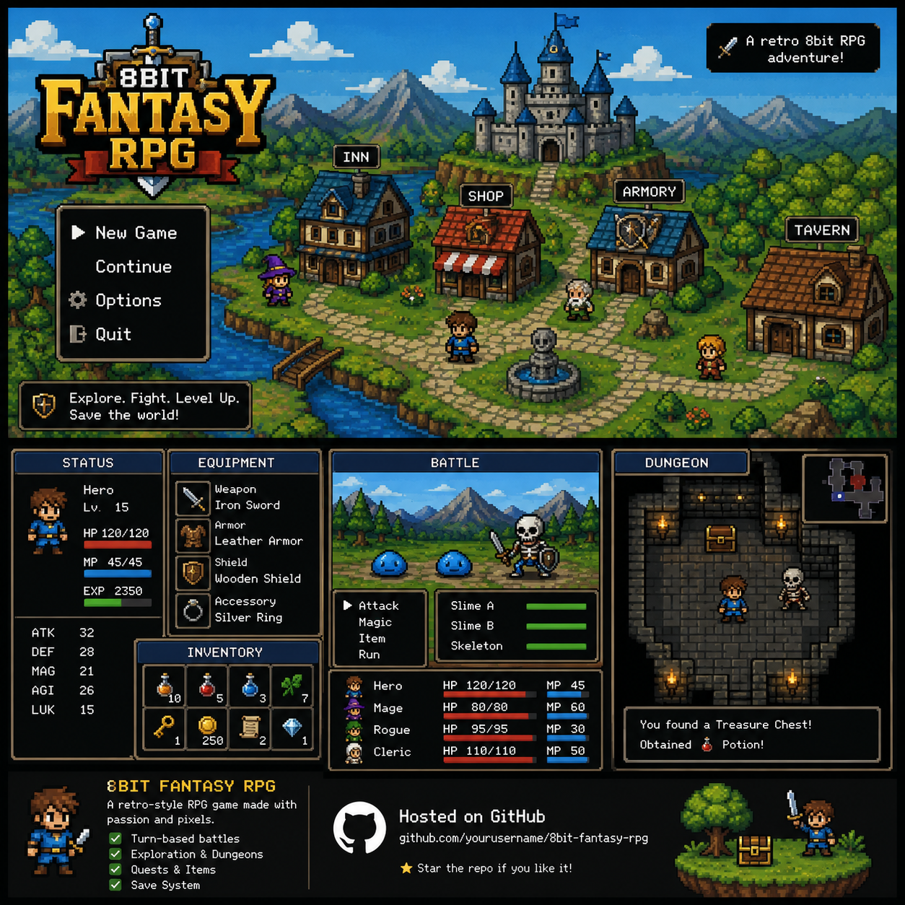

# Emberfall: Eclipse Roads Edition

A large, dependency-free dark-fantasy RPG built with vanilla HTML, CSS, and JavaScript. Eclipse Roads Edition combines the existing tabletop campaign systems with a faster cinematic action-RPG layer: stamina dodging, interactive battlefields, weapon affixes, enemy telegraphs, multi-phase bosses, companion commands, damage affinities, and stronger visual effects. It runs entirely in the browser and is ready for GitHub Pages.

## Campaign length

The expanded campaign is designed for approximately **2.5–3.5 hours** for a first complete playthrough. Play time depends on exploration, optional guild quests, arena battles, gathering, weapon shopping, and combat choices.

The main story contains **40 objectives across 10 acts**, beginning in Moonmere and ending inside the Ember Crown itself.

## World

Explore 18 connected maps, including seven major settlements:

1. Moonmere Village
2. Whisperwood
3. Greymoor City
4. Greymoor Sewers
5. Dawnwatch Village
6. Stormfen Marsh
7. Ironridge City
8. Royal Star Mines
9. Sunspire City
10. Ember Dunes
11. Mirage Oasis
12. Temple of Glass
13. Frosthollow Village
14. Crystal Cavern
15. Starfall City
16. Sky Ruins
17. Ashen Citadel
18. Crown Core

Maps include detailed pixel scenery such as docks, wells, bridges, fountains, market carts, shrines, mine rails, crystals, hot springs, observatories, floating ruins, throne rooms, and crown-fire.

## Playable jobs

Choose one permanent job when starting a new adventure:

- **Vanguard** — durable physical fighter with Power Strike and War Cry
- **Arcanist** — high-mana spellcaster with Arc Bolt and Starfall
- **Ranger** — multi-hit and poison specialist with Twin Shot and Venom Arrow
- **Paladin** — defensive holy warrior with Radiant Smite and Sanctuary
- **Rogue** — critical and evasion specialist with Backstab and Smoke Veil
- **Cleric** — healing caster with Light Spear and Greater Heal
- **Spellblade** — hybrid fighter with Flame Arc and Mana Edge

Every job has different base stats, level growth, skills, and weapon compatibility.

## Weapons and progression

The game contains **29 named weapons** across swords, axes, bows, staves, maces, daggers, and rapiers. Visit weapon shops in several cities to buy, collect, equip, and compare gear.

Progression also includes:

- Experience and level growth
- Job-specific HP, MP, Attack, and Defense
- Potions and defense-piercing Crown Bombs
- Weapon inventory and equipment menu
- Herbs, ore, crystals, and shells
- Hidden lore tablets
- Local save and continue support

## Additional gameplay

- Six optional guild contracts with rewards
- Repeatable scaling arena battles in Ironridge
- Gathering nodes and hidden treasure
- Optional Crystal Cavern exploration
- Day-to-night tint cycle
- Nine boss encounters
- 26 enemy types
- A complete ending with campaign statistics

## Eclipse Roads combat

Battles now include a more interactive action system:

- Location-specific animated battle scenes for forests, cities, mines, marshes, deserts, snowfields, sky ruins, the Citadel, and the Crown Core
- Timed basic attacks with Good, Great, and Perfect hit windows
- Enemy intent telegraphs for strikes, crushing blows, mana attacks, healing, wards, and boss catastrophes
- A stagger meter that can break enemy turns and create openings
- An action-variety combo chain with increasing damage bonuses
- A momentum gauge that unlocks a unique ultimate Roadburst for every job
- Animated lunges, impacts, slash effects, flashes, floating damage numbers, healing numbers, and boss introductions
- C, B, A, and S victory ranks with better gold rewards and possible S-rank item bonuses
- Number-key battle shortcuts and Space/Enter support for timed strikes
- A 100-point Stamina resource with an active Dodge action and Dexterity-based evasion check
- Biome-specific interactive battlefield objects such as powder casks, prism pylons, ore carts, storm conductors, and healing springs
- High-rank victories can awaken up to three magic/rare/epic affixes on the equipped weapon
- Affixes can improve damage, critical chance, Armor Class, attack rolls, skill power, Momentum, stagger, or life recovery
- Stronger camera shake, boss phase transitions, arena perspective, atmospheric lighting, and dark-fantasy UI treatment

## Controls

- Move: Arrow keys or WASD
- Interact / advance dialogue: Space or Enter
- Gear and guild record: G
- Close menu: Escape
- Mute: M
- Battle shortcuts: 1–9 select core actions; `0` Dodge; `E` use the battlefield; Space or Enter confirms a timed strike
- Mobile: On-screen D-pad, action button, and touch-friendly battle controls

## Run locally

Open `index.html` in a modern browser. No package installation, server, framework, or build step is required.

## Publish with GitHub Pages

1. Create a GitHub repository, such as `emberfall-rpg`.
2. Upload every file in this folder, including the hidden `.github` folder.
3. Open **Settings → Pages** in the repository.
4. Under **Build and deployment**, select **GitHub Actions**.
5. Commit or push the project to the `main` branch.

The included workflow deploys the static game automatically. The public address will use this format:

`https://YOUR-USERNAME.github.io/emberfall-rpg/`

## Customize

- Story, maps, jobs, enemies, quests, weapons, and battle rules: `game.js`
- Colors, layout, menus, and responsive design: `styles.css`
- Page metadata and interface structure: `index.html`
- Social preview artwork: `assets/promo.png`

## Save compatibility

This edition writes save format version 5 and automatically migrates compatible version 3/4 Campaign Master and Codex saves. New Stamina and weapon-affix fields are filled in automatically when an older compatible save is loaded.

## License

MIT — modify, remix, and publish your own version.

## Graphic Upgrade Edition

This build adds enhanced pixel-art terrain shading, richer environmental props, biome ambient particles, cinematic vignette lighting, improved battle depth, glowing boss presentation, animated HUD meters, and a more polished retro display treatment. The game remains lightweight and requires no build tools.

---

## Mobile Edition

This package is now a touch-first Progressive Web App (PWA) for Android and iPhone/iPad.

### Mobile features

- Responsive portrait and landscape layouts
- Large safe-area-aware touch controls
- Hold the D-pad to keep walking
- Swipe on the map to move one tile
- Haptic feedback on supported phones
- Compact in-game HP, MP, level, job, and gold display
- Fullscreen button and landscape battle layout
- Screen wake lock during long play sessions where supported
- Offline play after the first successful load
- Home-screen installation through the browser
- Existing desktop keyboard controls and save format remain compatible

### Install on Android

1. Open the GitHub Pages game in Chrome.
2. Tap **INSTALL** when it appears, or open Chrome's menu and choose **Install app** / **Add to Home screen**.
3. Launch Emberfall from the home screen for standalone fullscreen play.

### Install on iPhone or iPad

1. Open the GitHub Pages game in Safari.
2. Tap the Share button.
3. Choose **Add to Home Screen**.
4. Launch Emberfall from the new home-screen icon.

Landscape orientation gives the largest battle view, but portrait mode is fully supported.

## Tabletop Roads upgrade
- Four permanent companions with exploration and combat passives.
- Six ability scores and d20-style checks with DCs, natural 20s/1s, consequences, rewards, and Inspiration rerolls.
- Initiative and Armor Class in battle.
- Balanced, Bold, Warded, and Cunning tactical stances.
- Inspiration grants advantage on the next weapon attack.
- Parchment, brass, runic, dice, compass, dungeon-lighting, and boss-visual upgrades.

The rules are original to Emberfall and evoke tabletop fantasy without copying a specific tabletop ruleset.

## Adventurer’s Codex upgrade

This edition deepens the tabletop-fantasy feel while remaining an original Emberfall ruleset and art direction.

- Branching road encounters: each scene offers three approaches using different ability scores, DCs, rewards, and consequences.
- Camp system: Short Rest, Prepare, Scout Ahead, or Forage once per area visit. Rations now matter on long expeditions.
- Armor progression: seven armor sets from Road Leathers to Starfall Aegis modify Armor Class.
- Relic equipment: boss relics and rare charms grant check, AC, attack, critical, guard, or damage bonuses.
- Companion battle assists: every companion has a once-per-battle signature action.
- Tactical range: Close, Mid, and Far positioning changes weapon effectiveness and enemy accuracy.
- Saving throws: dangerous enemy abilities can trigger Wisdom or Dexterity saves to reduce their effects.
- Renown and choice tracking are recorded on the character sheet and ending summary.
- Stronger tabletop graphics: visible battle-mat grid, torchlight/fog treatment, codex-style equipment cards, campfire scene, and richer parchment/brass UI.

Keyboard shortcuts remain available; `R` opens Camp and `C` opens the character sheet.

## Campaign Master upgrade

This edition adds a deeper original tabletop-fantasy combat layer:

- Visible initiative order for Rowan, the companion, and the enemy.
- A unique class reaction for every one of the seven jobs.
- Companion battle commands now recharge after several rounds instead of being limited to once per battle.
- Physical, fire, arcane, radiant, and poison damage interact with enemy-family weaknesses and resistances.
- Bosses enter stronger second and third phases with more aggressive intent patterns.
- Two new enemy intents: Wide Sweep rewards range control; Dread Hex can impose disadvantage on the next weapon attack.
- Rare post-battle relic drops with uncommon, rare, and epic finds.
- Class features now have real combat effects, including ranger long-range critical bonuses, paladin low-HP defense, rogue opening advantage, arcanist skill scaling, and spellblade Perfect-hit mana recovery.
- The character sheet now documents the class feature, class reaction, affinity system, victories, and rare finds.
- Battle scenes use a stronger tabletop battle-mat, miniature-base, brass-ledger, initiative, and boss-phase visual language.

The mechanics, names, art direction, code, and setting remain original to Emberfall; this project does not copy proprietary D&D text, settings, characters, or artwork.

## Repository safety

This game is a static browser/PWA project and does not require Windows executables. The included `.gitignore` blocks common executable, installer, script, temporary, secret, and archive files, including `update_task.exe`.

If an executable was already committed before `.gitignore` was added, remove it from Git tracking and commit that removal. `.gitignore` only prevents new untracked files from being added.
